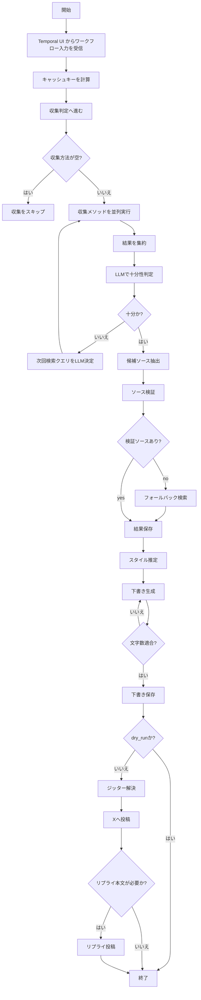

# auto-twitterer

`auto-twitterer` は、Temporal 上で実行される **X (Twitter)** 投稿ワークフローです。  
入力となるワークフロー入力に基づいて、情報収集→スタイル推定→下書き生成→（必要なら）投稿までを実行します。

- 情報収集を複数ソースから実施可能
- LLM で投稿本文を生成
- 文章トーンを `styleEstimation` で制御
- 投稿時刻にジッターを付与して自然なタイミングを再現
- `dry_run` で投稿なし検証が可能
- Temporal UI から起動する運用を前提

---

## 特徴

- Temporal ワークフロー + ワーカー構成
- LLM を使った情報収集の十分性判定と再検索ループ
- 情報収集ソース（アクティブ）
  - X API
  - Bird API
  - Firecrawl
  - DuckDuckGo
- RSS を受けるパッシブ系フロー（シグナルベース）
- スタイル推定は `styleEstimation.examples` と `styleEstimation.instruction` に基づく
- 投稿時間の揺らぎ（ジッター）
- macOS での `launchctl`（LaunchAgent）デプロイ対応
- ワークフロー実行結果は `cache` に蓄積

---

## インストール

```bash
bun install
```

---

## ワーカー起動

### 開発

```bash
TEMPORAL_NAMESPACE=auto-twitterer \
TEMPORAL_TASK_QUEUE=default \
bun run worker:dev
```

### 本番系デプロイ（LaunchAgent）

```bash
TEMPORAL_NAMESPACE=auto-twitterer \
TEMPORAL_TASK_QUEUE=default \
bun run worker:launchctl:deploy
```

停止:

```bash
bun run worker:launchctl:bootout
```

- `bun run worker:launchctl:deploy` はテンプレートを元に `~/Library/LaunchAgents/com.auto-twitterer.worker.plist` を生成・登録します。
- `worker.ts` の変更を反映するには再デプロイが必要です。

---

## Temporal 名前空間操作

名前空間一覧:

```bash
bun run temporal:namespace:list
```

名前空間作成:

```bash
TEMPORAL_NAMESPACE=auto-twitterer bun run temporal:namespace:create
```

---

## Alloy ログ連携（任意）

以下コマンドは macOS で Alloy を使い `logs/` 配下のログを送信するためのものです。

```bash
brew install grafana/alloy/alloy
./bin/deploy-alloy.sh
```

- `./bin/deploy-alloy.sh` は `logs/` のローテーションも含めて登録します。
- 送信先 URL は `deploy/auto-twitterer.alloy.template` の `__LOKI_URL__` を置換して指定します。

---

## ワークフロー実行

このリポジトリは CLI 実行ではなく **Temporal UI** からの開始を前提としています。

提供ワークフロー:

- `activeInformationCollectWorkflow`
- `passiveInformationCollectWorkflow`
- `generateAndPublishWorkflow`

投稿は `dry_run = false` の場合のみ実行されます。

---

## ワークフロー入力（主要）

### アクティブ収集ワークフロー例

`activeInformationCollectWorkflow` 向け:

```json
{
  "dry_run": true,
  "collecting": {
    "instruction": "収集した情報が投稿生成に十分かを判定し、足りない場合は次の検索キーワードを提案する文脈を示す指示。",
    "active": {
      "methods": ["xapi", "firecrawl", "bird"],
      "xapi": {
        "target_accounts": ["OpenAI", "AnthropicAI"],
        "max_iterations": 2
      },
      "bird": {
        "target_accounts": ["xAI"],
        "max_iterations": 2
      },
      "firecrawl": {
        "keywords": "auto",
        "urls": [],
        "max_iterations": 2
      },
      "duckduckgo": {
        "keywords": ["AI 開発動向", "エンジニアリング運用"],
        "urls": ["https://www.google.com"],
        "max_iterations": 2
      }
    }
  },
  "generation": {
    "instruction": "エンジニア向けに実践的で短い投稿を1件生成する。",
    "generate_hashtags": false,
    "append_thread_notice": false,
    "reply_source_url": false
  },
  "styleEstimation": {
    "instruction": "断定しすぎず、実務に落とし込める実践的なトーン。宣伝臭を抑える。",
    "examples": [
      "大規模な自動化を回す前に、インシデント時の巻き戻し手順を先に決める。",
      "意思決定は軽量に。スケール前にロールバック規則を定義しておく。"
    ]
  },
  "posting": {
    "jitter_minutes": 15
  },
  "debug": {
    "from_step": "collect"
  },
  "auth": {
    "bird": {
      "authToken": "your_bird_auth_token",
      "ct0": "your_bird_ct0"
    },
    "xapi": {
      "apiKey": "YOUR_XAPI_API_KEY",
      "apiSecret": "YOUR_XAPI_API_SECRET",
      "accessToken": "YOUR_XAPI_ACCESS_TOKEN",
      "accessSecret": "YOUR_XAPI_ACCESS_SECRET"
    },
    "firecrawl": {
      "apiKey": "YOUR_FIRECRAWL_API_KEY"
    },
    "anthropic": {
      "apiKey": "YOUR_ANTHROPIC_API_KEY"
    },
    "slack": {
      "webhookUrl": "YOUR_SLACK_WEBHOOK_URL",
      "mentionId": "YOUR_SLACK_MENTION_ID"
    }
  }
}
```

### パッシブ収集ワークフロー例

`passiveInformationCollectWorkflow` 向け:

```json
{
  "dry_run": true,
  "collecting": {
    "instruction": "受け取った RSS ペイロードが投稿候補として扱えるかを判定するための指示。",
    "passive": {
      "source_type": "rss",
      "transformer": "example-transformer.ts",
      "continue_as_new_after_items": 100
    }
  },
  "generation": {
    "instruction": "受信シグナルを要約して、短く自然な投稿を1件生成する。",
    "generate_hashtags": false,
    "append_thread_notice": false,
    "reply_source_url": true
  },
  "styleEstimation": {
    "instruction": "実践的で簡潔な口調。誇張や宣伝調を避ける。",
    "examples": [
      "実装前に検証方法を定義しておくと、品質が安定する。",
      "即時対応より復元可能な設計の方が、事故時の復旧速度を上げる。"
    ]
  },
  "posting": {
    "jitter_minutes": 15
  },
  "auth": {
    "anthropic": {
      "apiKey": "YOUR_ANTHROPIC_API_KEY"
    }
  }
}
```

補足:

- `passive` ではワークフロー起動時に `transformer` が必須。
- `runtime.processed_item_ids` は重複抑止に使用。
- `runtime.pending_signals` は継続実行（continue-as-new）を跨いだ未処理シグナル保持に使用。

---

## アーキテクチャ

### ワークフロー構成

- `activeInformationCollectWorkflow`
  - 通常の情報収集ワークフロー
  - X API / Bird / Firecrawl / DuckDuckGo を並列実行
  - `generateAndPublishWorkflow` を子ワークフローとして起動
- `passiveInformationCollectWorkflow`
  - シグナルを受ける長寿命ワークフロー
  - `collecting.passive.transformer` でデータ変換
  - `generateAndPublishWorkflow` を子ワークフローとして起動
- `generateAndPublishWorkflow`
  - 生成・検証・投稿までを担当する共通ワークフロー

### 収集ステップ

1. 有効な収集方法を並列実行
2. 取得結果をマージ
3. LLM で十分性判定
4. 不十分なら追加検索キーワードを生成してループ
5. `collecting.active.methods` が空の場合は収集をスキップ

### RSS 検証フロー

1. `passiveInformationCollectWorkflow` を起動
2. `collecting.passive.source_type` を `"rss"` に設定
3. `transformers/` 配下の変換ファイルを `collecting.passive.transformer` に指定
4. 実行中に `ingestPassiveInformation` シグナルで RSS ペイロードを送信
5. 変換ジョブごとに `generateAndPublishWorkflow` を起動

---

## スタイル推定

次の2つを元に推定します:

- `styleEstimation.instruction`
- `styleEstimation.examples`

推定結果はキャッシュされ、同一ハッシュでは再計算を抑制します。

---

## 投稿生成

- 1ワークフロー実行につき1投稿をデフォルトで生成
- 過去投稿履歴は `.cache/db.json` から取得
- 直近5件のみプロンプトへ含める
- 文字数超過時は再生成を実施

生成された下書きはローカルへ保存:

- `.cache/drafts/*.json`

---

## 投稿

`dry_run = false` の場合:

1. 投稿時刻を決定
2. `posting.jitter_minutes` の範囲で揺らぎを加算
3. 到来まで待機（必要時）
4. 本文投稿
5. `reply_source_url` が有効なら関連リプライを実行

---

## キャッシュ

保存先:

- 実行時キャッシュ: `.cache/db.json`
- 下書きキャッシュ: `.cache/drafts/*.json`

キー構成:

- ワークフローキー: 実行入力の正規化文字列のハッシュ
- 履歴キー: `generation.instruction` のハッシュ
- スタイルキー: `styleEstimation.instruction + examples` のハッシュ

---

## 環境変数

以下は主に起動時に使用されます。

- `TEMPORAL_ADDRESS`（デフォルト: `localhost:7233`）
- `TEMPORAL_NAMESPACE`（デフォルト: `auto-twitterer`）
- `TEMPORAL_TASK_QUEUE`（デフォルト: `default`）

これらは LaunchAgent 作成時にも反映されます。

---

## システムフロー



---

## ライセンス

MIT ライセンス
